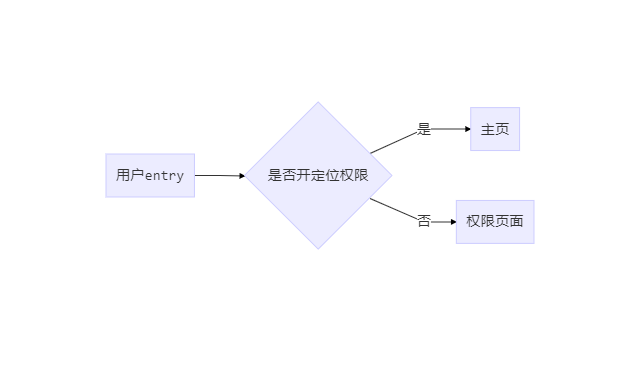
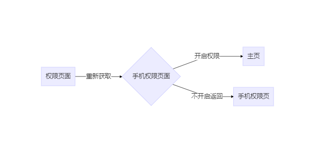
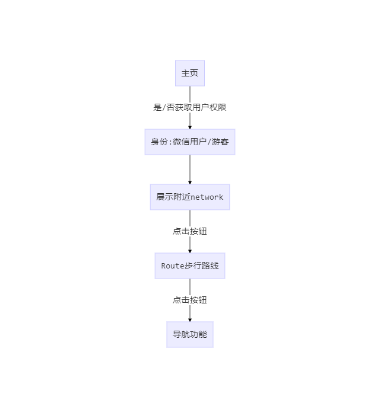

# mpvue-netbar

> mpvue 组件化开发 地图组件系列

## 设计初衷
&nbsp;&nbsp;本人喜欢上网,穿梭各大城市之间时 眼光不光停留在山水高楼之间 也会驻扎于网咖，因为没钱住旅馆 那仿佛就像我的家，我的港湾，正好基于mpvue就想开发一套找网咖的小程序
1.0版本：在借鉴了大神小明找厕所小程序版后开发的，具体功能如下:  
1.定位附近网咖  
2.展示网咖信息  
3.点击绘制步行路线  
4.手机定位导航  
emmmm, 我知道这段开门见山的话很拙 没事 感兴趣你继续往下瞅瞅~

### 项目入口
<p>
  
</p>


## 初始化

``` bash
# 全局安装 vue-cli
$ npm install --global vue-cli

# 创建一个基于 mpvue-quickstart 模板的新项目
$ vue init mpvue/mpvue-quickstart mpvue-network

# 安装依赖
$ cd mpvue-network
$ npm install  或者 cnpm install (淘宝镜像)
# 启动构建
$ npm run dev
```
## 项目主结构
> vue 组件化
```
│  
├─api                         //接口 js 支持wx promise写法
│      requestIntercept.js    
│      wxp.js
│      
├─components                  //组件
│      address.vue            //展示bar地址信息组件
│      net-fixed.vue          //定位按钮组件 用于跳转
│      net-map.vue            //地图组件基于wx map
│      permis.vue             //权限组件基于 wx 权限
│      
├─pages                       //小程序页面
│  ├─goBar                    //Route 步行规划页面
│  │      index.vue
│  │      main.js             
│  │      
│  └─index                    //项目主页面 数据的分配
│          index.vue
│          main.js
│          
├─store                       // vuex
│      action.js
│      getters.js
│      index.js
│      mutation-types.js
│      mutations.js
│      state.js
├─utils                       // 工具类
│
│  App.vue                    // 不解释
│  bus.js                     // Vue Bus
│  global.js                  // Vue.prototype 拓展 wx api 
│  main.js                    // mpvue 入口
```

### 设计流程图
<p>
  
  
  
</p>

### js部分
&nbsp;&nbsp;这是 pages下index的主页面 组件思想编写, 数据采用vuex存储 && 组件通信 
``` js
<div class="container">
    <div v-if="permit">
      <net-map
        :longitude="longitude"
        :latitude="latitude"
        :search="search">
      </net-map>
      <net-address></net-address>
      <net-fixed :cname="fxClass"
                 typeInfo="info"
                 :fxShow="fxShow"
                 @click="goDetail">

      </net-fixed>
    </div>
    <permission
      @changePermit="changePermit"
      @setLocation="setLocation"
      @getUserInfo="getUserInfo"
      @openSetting="openSetting">
    </permission>
  </div>
```

### 总结
&nbsp;&nbsp;相对于mpvue 就是算踩坑了 里面有很多意想不到的问题的，对于该项目还是总结以下几点:    
1.在mpvue里尽量不要用小程序生命周期。    
2.在mpvue里没有router每个页面需要配置main.js以及接口交互最好用flyio,如果对这几点深感洁癖的追求完美的可以用大神的插件:      
* [mpvue-entry](https://github.com/F-loat/mpvue-entry) - 集中式页面配置，不再需要重复编辑各页面的 main.js 文件  
* [mpvue-router-patch](https://github.com/F-loat/mpvue-router-patch) - 在 mpvue 中使用 vue-router 兼容的路由写法  
* [fly](https://github.com/wendux/fly) - 支持所有JavaScript运行时请求转发和基于Promise的HTTP客户端    

3.模块化思想很重要 写之前整理好  
4.webpack 解析wx 需要配置，mpvue框架 组件化css 需要配置 等等都需要注意 有问题请看mpvue的Issues    
5.mpvue 数据data方面不能放过多数据 要把业务和组件抽离分开    
6.真的意识到写好项目不难，但是写出一个可维护且高质量的代码真的很难。
7.该项目目前是1.0版本, 默认只是查询附近网吧功能，实际上组件已经抽离出来 可通过父组件传值改变搜索的内容，后期还会逐步升级，希望通过爬虫获取详情数据，敬请期待。
